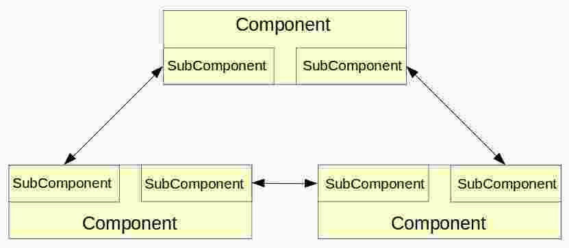

# Networking Components

The previous examples have demonstrated communication between two components.  But this is a rather simple situation.  In general, simulations can consist of multiple components all communicating with each other in a star or mesh configuration.

For this example, the simulation will be expanded in this fashion.  An additional component will be added and each component updated to communicate with the other two.

The naive way to accomplish this is to change the component to include two links, each with their own message handler.  The problem with this approach is that each time the network configuration changes, the component will have to be updated and the simulation recompiled.

A better way is to take advantage of the subcomponent slot being able to contain multiple subcomponents of the same type.  Create a new subcomponent containing the link and use the python configuration file to insert multiple instances into each component's subcomponent slot.  This approach allows for multiple links to and from a component, as shown below.

<p style="margin-left:auto;margin-right:auto;width:50%">
    
</p>

To accomplish this we'll need to make the following changes.

1.  Update the subcomponent to include the link and associated functionality.
2.  Update the component to include multiple subcompnents.
3.  Modify the configuration file to include multiple components and their associated links.

## Example Setup

To set up for this example, perform the following steps:

1.  Navigate to the `example` folder and create a folder named `Example05`.
2.  Copy the `Example04` files to the `Example05` folder.
3.  Open the copied `ExampleComponent.h` file and change the namespace to `Example05`.
4.  Open the copied `ExampleComponent.cc` file and change the `using namespace` directive to refer to the `Example05` namespace.
5.  Open the copied `ExampleEvent.h` file and change the namespace to `Example05`.
6.  Open the copied `ExampleSubComponent.h` file and change the namespace to `Example05`.

## Updating the SubComponent

There are a number of changes required for the subcomponent so the easiest way to update it is to simply replace it.  Open the file `ExampleSubComponent.h` in the editor of your choice, delete all the code, and replace it with the listing shown below.

```
#ifndef EXAMPLE_SUBCOMPONENT_H
#define EXAMPLE_SUBCOMPONENT_H

#include <sst/core/subcomponent.h>
#include <sst/core/output.h>

#include "ExampleEvent.h"

const uint64_t FATAL = 0;
const uint64_t WARN  = 1;
const uint64_t INFO  = 2;
const uint64_t DEBUG = 3;
const uint64_t TRACE = 4;
const uint64_t ALL   = 5;

using namespace SST;

namespace Example05 
{
    class ExampleSubComponent : public SST::SubComponent
    {
        public:

            // Updated constructors.  No longer pass in a parent.
            // Instead, use a component id.
            //
            ExampleSubComponent(ComponentId_t id) :
                SubComponent(id)
            { 
            }

            ExampleSubComponent(ComponentId_t id, Params& params) :
                SubComponent(id)
            {        
            }

            virtual ~ExampleSubComponent() {}


            // Method to initialize the subcomponent.  Serves the same purpose as the 
            // start() method in a component.
            //
            void start(SST::ComponentId_t id, SST::Params &params, 
                uint64_t slotNumber)
            {
                // Process the incoming parameters.
                //
                componentId_ = id;
                slotNumber_ = slotNumber;

                std::string clock = 
                    params.find<std::string>("clock", "1GHz");  // Simulation clock rate.  Default to 1 GHz.
                unsigned int debug = 
                    params.find<int>("debug", ALL);             // Debug level.  Default to ALL.
                
                // Perform object initialization.
                //
                logger_ = SST::Output("Time=@t; File=@f; Func=@p; Line=@l; Thread=@I -- ", debug, 0x01, SST::Output::STDOUT);
                logger_.verbose(CALL_INFO, TRACE, 0x00, "Initializing subcomponent, slot number %lu in component id %lu\n", 
                    slotNumber_, componentId_);

                link_ = configureLink("link_", clock,
                    new SST::Event::Handler<ExampleSubComponent>(this, &ExampleSubComponent::messageHandler)); 
                
                logger_.verbose(CALL_INFO, TRACE, 0x00, "Subcomponent initialized.\n");
            }

            // Send the count over the link.
            //
            void sendCount() 
            {
                logger_.verbose(CALL_INFO, TRACE, 0x00, "Entering subcomponent method sendCount()\n");
                logger_.verbose(CALL_INFO, DEBUG, 0x00, "Creating message\n");
                ExampleEvent* ev = new ExampleEvent(count_++);

                logger_.verbose(CALL_INFO, INFO, 0x00, "Sending message from component %lu, slot %lu with count %u\n", 
                    componentId_, slotNumber_, ev->getPayload() );
                link_->send(ev);

                logger_.verbose(CALL_INFO, TRACE, 0x00, "Leaving subcomponent method sendCount()\n");
            }

            // Return the current clock tick count.
            //
            int getCount()
            {
                logger_.verbose(CALL_INFO, TRACE, 0x00, "Entering subcomponent method getCount()\n");
                return clockTickCount_;
                logger_.verbose(CALL_INFO, TRACE, 0x00, "Leaving subcomponent method getCount()\n");
            }

            // Clock handler.  This is the method called from the parent clock event.
            //
            virtual void clock(Cycle_t) 
            {
                logger_.verbose(CALL_INFO, TRACE, 0x00, "Entering subcomponent method clock\n");
                logger_.verbose(CALL_INFO, TRACE, 0x00, "Leaving subcomponent method clock\n");
            }

            // Event handler for incoming messages.
            //
            void messageHandler(SST::Event* event)
            {
                logger_.verbose(CALL_INFO, TRACE, 0x00, "Entering subcomponent messageHandler()\n");

                // Save the incoming value.
                //
                ExampleEvent* ev = static_cast<ExampleEvent*>(event);
                clockTickCount_ = ev->getPayload();
                logger_.verbose(CALL_INFO, INFO, 0x00, "Received clock tick %lu on component %lu at slot number %lu\n", 
                    clockTickCount_, componentId_, slotNumber_);

                // Don't forget to delete the event when you're done with it.
                // Otherwise you'll get a serious memory leak.
                //
                delete ev;
                logger_.verbose(CALL_INFO, TRACE, 0x00, "Leaving subcomponent messageHandler()\n");
            }

            // Document the component ports.
            //
            // Port name, description, vector fo supported events.
            //
            // Port name is just a name.  It can be anything that makes sense but will
            // be used later to refer to this port.
            //
            // Description is just that.  Can be anything.
            //
            // Support events is a std::vector of the names of supported events.  These
            // are initialized as {"lib1.event1", "lib1.event2", "lib2.event3"}.
            // Note these are the names as strings, not types.
            //
            SST_ELI_DOCUMENT_PORTS(
                { "link_", "Message port", {}}
            )

            // Register the subcomponent API.
            //
            SST_ELI_REGISTER_SUBCOMPONENT_API(Example05::ExampleSubComponent)

            // Register the subcomponent.
            //
            SST_ELI_REGISTER_SUBCOMPONENT_DERIVED(
                ExampleSubComponent,                // Name of the class being registered.
                                                    // INSERT_CLASS_NAME
                "example",                          // Element library.  Name of the .so.
                "ExampleSubComponent",              // Name used to reference the subcomponent.
                                                    // Can be anything but typically set to
                                                    // the class name.
                SST_ELI_ELEMENT_VERSION(1, 0, 0),   // 
                "Example subcomponent",             // Brief subcomponent description
                Example05::ExampleSubComponent      // Name of the subcomponent interface the
                                                    // subcomponent inherits from.  Should be
                                                    // the full parent class name.
                                                    // "INSERT_FULL_PARENT_CLASS_NAME" or 
                                                    // "INSERT_COMPLETE_NAMESPACE::INSERT_PARENT_CLASS_NAME"
            )

        private:
            // Links to connect to other component.
            // The link connects to the subcomponents port.
            //
            SST::Link* link_ = nullptr;

            // Count sent to the connected subcomponent.
            //
            SST::Output logger_;        // Used for logging messages.
            uint64_t componentId_;      // Id associated with the parent component.
            uint64_t slotNumber_;       // Slot number associated with the subcomponent.
            uint32_t count_ = 0;
            uint64_t clockTickCount_ = 0;
    };
}

#endif

```

The constructors and destructor remain unchanged.  However, there is a new `start()` method used to initialize the subcomponent.  This is where parameters for the subcomponent are processed and the link is initialized.

You may wonder, why not do this initialization in the subcomponent constructor?  For some reason the subcomponent constructors were not being called when created in the parent component.  Use of the `start()` method is a reasonable alternative that models the method used for top level components.  The difference is, this `start()` method will not be called automatically.  It must be called explicitly when the subcomponent is created.

```
            // Method to initialize the subcomponent.  Serves the same purpose as the 
            // start() method in a component.
            //
            void start(SST::ComponentId_t id, SST::Params &params, 
                uint64_t slotNumber)
            {
                // Process the incoming parameters.
                //
                componentId_ = id;
                slotNumber_ = slotNumber;

                std::string clock = 
                    params.find<std::string>("clock", "1GHz");  // Simulation clock rate.  Default to 1 GHz.
                unsigned int debug = 
                    params.find<int>("debug", ALL);             // Debug level.  Default to ALL.
                
                // Perform object initialization.
                //
                logger_ = SST::Output("Time=@t; File=@f; Func=@p; Line=@l; Thread=@I -- ", debug, 0x01, SST::Output::STDOUT);
                logger_.verbose(CALL_INFO, TRACE, 0x00, "Initializing subcomponent, slot number %lu in component id %lu\n", 
                    slotNumber_, componentId_);

                link_ = configureLink("link_", clock,
                    new SST::Event::Handler<ExampleSubComponent>(this, &ExampleSubComponent::messageHandler)); 
                
                logger_.verbose(CALL_INFO, TRACE, 0x00, "Subcomponent initialized.\n");
            }
```
Any functionality previously associated with communication between components must be moved to the subcomponent since the subcomponent now contains the links.  In this case, that includes code to maintain the transmitted count value and send it to the connected subcomponent, which is now located in the subcomponent's `sendCount()` method.  A corresponding `getCount()` method that returns the received count value is also available.  

```
            // Send the count over the link.
            //
            void sendCount() 
            {
                logger_.verbose(CALL_INFO, TRACE, 0x00, "Entering subcomponent method sendCount()\n");
                logger_.verbose(CALL_INFO, DEBUG, 0x00, "Creating message\n");
                ExampleEvent* ev = new ExampleEvent(count_++);

                logger_.verbose(CALL_INFO, INFO, 0x00, "Sending message from component %lu, slot %lu with count %u\n", 
                    componentId_, slotNumber_, ev->getPayload() );
                link_->send(ev);

                logger_.verbose(CALL_INFO, TRACE, 0x00, "Leaving subcomponent method sendCount()\n");
            }

            // Return the current clock tick count.
            //
            int getCount()
            {
                logger_.verbose(CALL_INFO, TRACE, 0x00, "Entering subcomponent method getCount()\n");
                return clockTickCount_;
                logger_.verbose(CALL_INFO, TRACE, 0x00, "Leaving subcomponent method getCount()\n");
            }
```

The link message handler has also been moved to the subcomponent but still serves the same purpose, to process incoming messages and extract the payload for later processing.

```
            // Event handler for incoming messages.
            //
            void messageHandler(SST::Event* event)
            {
                logger_.verbose(CALL_INFO, TRACE, 0x00, "Entering subcomponent messageHandler()\n");

                // Save the incoming value.
                //
                ExampleEvent* ev = static_cast<ExampleEvent*>(event);
                clockTickCount_ = ev->getPayload();
                logger_.verbose(CALL_INFO, INFO, 0x00, "Received clock tick %lu on component %lu at slot number %lu\n", 
                    clockTickCount_, componentId_, slotNumber_);

                // Don't forget to delete the event when you're done with it.
                // Otherwise you'll get a serious memory leak.
                //
                delete ev;
                logger_.verbose(CALL_INFO, TRACE, 0x00, "Leaving subcomponent messageHandler()\n");
            }
```

Finally, we still need to register the subcomponent and its API using the ELI macros.  However, we also need to register the link since it is now contained in the subcomponent.

```
            // Document the component ports.
            //
            // Port name, description, vector fo supported events.
            //
            // Port name is just a name.  It can be anything that makes sense but will
            // be used later to refer to this port.
            //
            // Description is just that.  Can be anything.
            //
            // Support events is a std::vector of the names of supported events.  These
            // are initialized as {"lib1.event1", "lib1.event2", "lib2.event3"}.
            // Note these are the names as strings, not types.
            //
            SST_ELI_DOCUMENT_PORTS(
                { "link_", "Message port", {}}
            )

            // Register the subcomponent API.
            //
            SST_ELI_REGISTER_SUBCOMPONENT_API(Example05::ExampleSubComponent)

            // Register the subcomponent.
            //
            SST_ELI_REGISTER_SUBCOMPONENT_DERIVED(
                ExampleSubComponent,                // Name of the class being registered.
                                                    // INSERT_CLASS_NAME
                "example",                          // Element library.  Name of the .so.
                "ExampleSubComponent",              // Name used to reference the subcomponent.
                                                    // Can be anything but typically set to
                                                    // the class name.
                SST_ELI_ELEMENT_VERSION(1, 0, 0),   // 
                "Example subcomponent",             // Brief subcomponent description
                Example05::ExampleSubComponent      // Name of the subcomponent interface the
                                                    // subcomponent inherits from.  Should be
                                                    // the full parent class name.
                                                    // "INSERT_FULL_PARENT_CLASS_NAME" or 
                                                    // "INSERT_COMPLETE_NAMESPACE::INSERT_PARENT_CLASS_NAME"
            )
```

## Updating the Component

Changes to the component fall into two different categories, those required by moving the link to the subcomponent and those required to account for multiple subcomponents in the subcomponent slot.

Open the file ExampleComponent.h and remove the reference to the `SST_ELI_DOCUMENT_PORTS` macro.  This is no longer required since the port has been moved to the subcomponent.

The next change requires more explanation.  Since each component communicates with multiple other components, it's no longer sufficient to watch for a single incoming message with the appropriate value to end the simulation.  Instead, messages coming in on each subcomponent must be watched and the simulation ended when the appropriate value has been received in all of them.  To track this, a boolean flag is associated with each subcomponent.  The flag is intended to indicate the corresponding subcomponent has received the appropriate value to end the simulation.  Once _all_ subcomponents contained within a component have this flag set to false, the component can indicate the simulation can end so far as it is concerned.

To accomplish this, the `subcomponentSlots_` vector is updated to contain pairs of values, the original `ExampleSubComponent` reference and the boolean flag.  The updated definition is shown below.

```
            // Slot to hold a subcomponent.
            //
            std::vector<std::pair<bool, ExampleSubComponent*>> subcomponentSlots_;
```

Finally, the reference to the `messageHandler` can be removed since the message handler function has been moved to the subcomponent along with the link.

Once these changes have been made, save them, close the file, and open the file ExampleComponent.cc.  Since the link and associated message handler function have been moved to the subcomponent, remove any references to the `link_` variable and `messageHandler` function in the `ExampleComponent` class.  Then, update the block where the subcomponents are created as shown below.

```
        // Create all the defined subcomponents.
        //
        long unsigned int maxSlot = info->getMaxPopulatedSlotNumber();
        logger_.verbose(CALL_INFO, DEBUG, 0x00, "There are %lu subcomponent slot entries\n", maxSlot + 1);
        for (int i = 0; i <= maxSlot; i++)
        {
            if (info->isPopulated(i))
            {
                logger_.verbose(CALL_INFO, DEBUG, 0x00, "Loading subcomponent into slot entry %d\n", i);  
                
                ExampleSubComponent* subComponent = info->create<ExampleSubComponent>(i, ComponentInfo::SHARE_NONE);
                subComponent->start(id, params, i);

                subcomponentSlots_.push_back(std::pair<bool, ExampleSubComponent*>(
                    true, subComponent));
            }
        }
```

The significant changes here are the call to the subcomponent `start()` method to initialize the subcomponent and pushing the `std::pair` to the `subcomponentSlots` vector rather than just the subcomponent.

Finally, update the clock handler as shown below.

```
// Clock event handler.
//
bool ExampleComponent::clockTick(SST::Cycle_t cycle)
{
    logger_.verbose(CALL_INFO, TRACE, 0x00, "Entering clock for component id %lu\n", componentId_);

    // Call clockTick for each of the subcomponents.
    //
    logger_.verbose(CALL_INFO, DEBUG, 0x00, "Calling clock tick for subcomponents.\n");
    for ( auto subcomponent : subcomponentSlots_) 
    {
        subcomponent.second->clock(cycle);
    }

    // Process each of the links.
    //
    logger_.verbose(CALL_INFO, DEBUG, 0x00, "Sending counts over the links.\n");
    bool done = true;    
    for (auto subcomponent : subcomponentSlots_)
    {
        // Send a message to the connected component.
        //
        logger_.verbose(CALL_INFO, DEBUG, 0x00, "Sending count\n");
        subcomponent.second->sendCount();

        // Get the subcomponent received count and compare it to the
        // number of allowed ticks.  Set the associated boolean as
        // appropriate.
        //
        logger_.verbose(CALL_INFO, DEBUG, 0x00, "Retrieving count\n");
        uint64_t count = subcomponent.second->getCount();
        logger_.verbose(CALL_INFO, DEBUG, 0x00, "Count = %lu\n", count);

        // If all the flags are false, then this component is done.
        //
        if (count >= clockTicks_)
            subcomponent.first = false;
        done = done & !subcomponent.first;
    }

    if (done)
    {
        logger_.verbose(CALL_INFO, DEBUG, 0x00, "Ending simulation for component id %lu.\n", componentId_);
        primaryComponentOKToEndSim();
    }
    
    logger_.verbose(CALL_INFO, TRACE, 0x00, "Leaving clock for component id %lu\n", componentId_);
    return done;
}
```

The primary change here is in the loop over all subcomponents.  First, the subcomponent is called to send a count to the connected subcomponent.  Then the most recent received count is retrieved and compared to the limit.  If the count limit has been reached the flag is set to false.  Finally, a flag is updated to monitor if all subcomponents have received the count limit.  

This process is repeated for each subcomponent.  At the end of the loop if the flag indicates all subcomponents have reached their limit, a call to `primaryComponentOKToSendSim()` is made to indicate that, so far as this component is concerned, it's ok to end the simulation.

## Modifying the Configuration File

The simulation configuration file is listed below.

```
# Execute from the command line with the command:
#   sst exampleConfig.py 2>&1 | tee test.log
#
import sst

# Initialize local variables.
#
clockTicks = "5"
clock = "1GHz"
debug = "2"     #0 = FATAL, 1 = WARN, 2 = INFO, 3 = DEBUG, 4 = TRACE, 5 = ALL

# Define the component.
#
# The parameters are a dictionary and can be any key/value pair defined
# by the component itself.
#
# The second parameter is <library>.<registered_name> specified in
# SST_ELI_REGISTER_COMPONENT.
#
component0 = sst.Component("component0", "example.ExampleComponent")
component0.addParams({
    "clock"      : clock,
    "clockTicks" : clockTicks,
    "debug"      : debug
    })
subcomponent0_0 = component0.setSubComponent("slot_", "example.ExampleSubComponent", 0)
subcomponent0_1 = component0.setSubComponent("slot_", "example.ExampleSubComponent", 1)

component1 = sst.Component("component1", "example.ExampleComponent")
component1.addParams({
    "clock"      : clock,
    "clockTicks" : clockTicks,
    "debug"      : debug
})
subcomponent1_0 = component1.setSubComponent("slot_", "example.ExampleSubComponent", 0)
subcomponent1_1 = component1.setSubComponent("slot_", "example.ExampleSubComponent", 1)

component2 = sst.Component("component2", "example.ExampleComponent")
component2.addParams({
    "clock"      : clock,
    "clockTicks" : clockTicks,
    "debug"      : debug
})
subcomponent2_0 = component2.setSubComponent("slot_", "example.ExampleSubComponent", 0)
subcomponent2_1 = component2.setSubComponent("slot_", "example.ExampleSubComponent", 1)

# Connect the objects to each other.
#
link0_1 = sst.Link("link0_1")
link1_2 = sst.Link("link1_2")
link2_0 = sst.Link("link2_0")
link0_1.connect((subcomponent0_0, "link_", "5ns"), (subcomponent1_1, "link_", "5ns"))
link1_2.connect((subcomponent1_0, "link_", "5ns"), (subcomponent2_1, "link_", "5ns"))
link2_0.connect((subcomponent2_0, "link_", "5ns"), (subcomponent0_1, "link_", "5ns"))
```

Its operation is straightforward.  Each component is created, along with its associated subcomponents.  Notice each subcomponent is assigned to the same subcomponent slot but with a different slot number.  The slot numbers do not have to be consecutive but in this case it makes it easier to keep track of them.

Finally the links are created.  Notice that since the link ports are now located in the subcomponents, the subcomponents are passed to the link `connect()` method, not the components.

## Building and Executing the Simulation

No changes to the make file are required.  To build the simulation, open a terminal, navigate to the Example05 folder, and execute the command

```
make clean; make
```

If there are errors, examine the source files to find the error and try again.

Once the build is complete, run the simulation using the command

```
sst ExampleConfig.py
```
For this example, the output below will be displayed.

```
Time=0; File=ExampleComponent.cc; Func=ExampleComponent; Line=34; Thread=0 -- Initializing component 0.
Time=0; File=ExampleComponent.cc; Func=ExampleComponent; Line=37; Thread=0 -- Constructing new Example Instance.
Time=0; File=ExampleComponent.cc; Func=ExampleComponent; Line=75; Thread=0 -- Successfully initialized clock.
Time=0; File=ExampleComponent.cc; Func=ExampleComponent; Line=34; Thread=0 -- Initializing component 1.
Time=0; File=ExampleComponent.cc; Func=ExampleComponent; Line=37; Thread=0 -- Constructing new Example Instance.
Time=0; File=ExampleComponent.cc; Func=ExampleComponent; Line=75; Thread=0 -- Successfully initialized clock.
Time=0; File=ExampleComponent.cc; Func=ExampleComponent; Line=34; Thread=0 -- Initializing component 2.
Time=0; File=ExampleComponent.cc; Func=ExampleComponent; Line=37; Thread=0 -- Constructing new Example Instance.
Time=0; File=ExampleComponent.cc; Func=ExampleComponent; Line=75; Thread=0 -- Successfully initialized clock.
Time=1000; File=ExampleSubComponent.h; Func=sendCount; Line=85; Thread=0 -- Sending message from component 0, slot 0 with count 0
Time=1000; File=ExampleSubComponent.h; Func=sendCount; Line=85; Thread=0 -- Sending message from component 0, slot 1 with count 0
Time=1000; File=ExampleSubComponent.h; Func=sendCount; Line=85; Thread=0 -- Sending message from component 1, slot 0 with count 0
Time=1000; File=ExampleSubComponent.h; Func=sendCount; Line=85; Thread=0 -- Sending message from component 1, slot 1 with count 0
Time=1000; File=ExampleSubComponent.h; Func=sendCount; Line=85; Thread=0 -- Sending message from component 2, slot 0 with count 0
Time=1000; File=ExampleSubComponent.h; Func=sendCount; Line=85; Thread=0 -- Sending message from component 2, slot 1 with count 0
Time=2000; File=ExampleSubComponent.h; Func=sendCount; Line=85; Thread=0 -- Sending message from component 0, slot 0 with count 1
Time=2000; File=ExampleSubComponent.h; Func=sendCount; Line=85; Thread=0 -- Sending message from component 0, slot 1 with count 1
Time=2000; File=ExampleSubComponent.h; Func=sendCount; Line=85; Thread=0 -- Sending message from component 1, slot 0 with count 1
Time=2000; File=ExampleSubComponent.h; Func=sendCount; Line=85; Thread=0 -- Sending message from component 1, slot 1 with count 1
Time=2000; File=ExampleSubComponent.h; Func=sendCount; Line=85; Thread=0 -- Sending message from component 2, slot 0 with count 1
Time=2000; File=ExampleSubComponent.h; Func=sendCount; Line=85; Thread=0 -- Sending message from component 2, slot 1 with count 1
Time=3000; File=ExampleSubComponent.h; Func=sendCount; Line=85; Thread=0 -- Sending message from component 0, slot 0 with count 2
Time=3000; File=ExampleSubComponent.h; Func=sendCount; Line=85; Thread=0 -- Sending message from component 0, slot 1 with count 2
Time=3000; File=ExampleSubComponent.h; Func=sendCount; Line=85; Thread=0 -- Sending message from component 1, slot 0 with count 2
Time=3000; File=ExampleSubComponent.h; Func=sendCount; Line=85; Thread=0 -- Sending message from component 1, slot 1 with count 2
Time=3000; File=ExampleSubComponent.h; Func=sendCount; Line=85; Thread=0 -- Sending message from component 2, slot 0 with count 2
Time=3000; File=ExampleSubComponent.h; Func=sendCount; Line=85; Thread=0 -- Sending message from component 2, slot 1 with count 2
Time=4000; File=ExampleSubComponent.h; Func=sendCount; Line=85; Thread=0 -- Sending message from component 0, slot 0 with count 3
Time=4000; File=ExampleSubComponent.h; Func=sendCount; Line=85; Thread=0 -- Sending message from component 0, slot 1 with count 3
Time=4000; File=ExampleSubComponent.h; Func=sendCount; Line=85; Thread=0 -- Sending message from component 1, slot 0 with count 3
Time=4000; File=ExampleSubComponent.h; Func=sendCount; Line=85; Thread=0 -- Sending message from component 1, slot 1 with count 3
Time=4000; File=ExampleSubComponent.h; Func=sendCount; Line=85; Thread=0 -- Sending message from component 2, slot 0 with count 3
Time=4000; File=ExampleSubComponent.h; Func=sendCount; Line=85; Thread=0 -- Sending message from component 2, slot 1 with count 3
Time=5000; File=ExampleSubComponent.h; Func=sendCount; Line=85; Thread=0 -- Sending message from component 0, slot 0 with count 4
Time=5000; File=ExampleSubComponent.h; Func=sendCount; Line=85; Thread=0 -- Sending message from component 0, slot 1 with count 4
Time=5000; File=ExampleSubComponent.h; Func=sendCount; Line=85; Thread=0 -- Sending message from component 1, slot 0 with count 4
Time=5000; File=ExampleSubComponent.h; Func=sendCount; Line=85; Thread=0 -- Sending message from component 1, slot 1 with count 4
Time=5000; File=ExampleSubComponent.h; Func=sendCount; Line=85; Thread=0 -- Sending message from component 2, slot 0 with count 4
Time=5000; File=ExampleSubComponent.h; Func=sendCount; Line=85; Thread=0 -- Sending message from component 2, slot 1 with count 4
Time=6000; File=ExampleSubComponent.h; Func=sendCount; Line=85; Thread=0 -- Sending message from component 0, slot 0 with count 5
Time=6000; File=ExampleSubComponent.h; Func=sendCount; Line=85; Thread=0 -- Sending message from component 0, slot 1 with count 5
Time=6000; File=ExampleSubComponent.h; Func=sendCount; Line=85; Thread=0 -- Sending message from component 1, slot 0 with count 5
Time=6000; File=ExampleSubComponent.h; Func=sendCount; Line=85; Thread=0 -- Sending message from component 1, slot 1 with count 5
Time=6000; File=ExampleSubComponent.h; Func=sendCount; Line=85; Thread=0 -- Sending message from component 2, slot 0 with count 5
Time=6000; File=ExampleSubComponent.h; Func=sendCount; Line=85; Thread=0 -- Sending message from component 2, slot 1 with count 5
Time=6000; File=ExampleSubComponent.h; Func=messageHandler; Line=119; Thread=0 -- Received clock tick 0 on component 1 at slot number 1
Time=6000; File=ExampleSubComponent.h; Func=messageHandler; Line=119; Thread=0 -- Received clock tick 0 on component 0 at slot number 0
Time=6000; File=ExampleSubComponent.h; Func=messageHandler; Line=119; Thread=0 -- Received clock tick 0 on component 2 at slot number 1
Time=6000; File=ExampleSubComponent.h; Func=messageHandler; Line=119; Thread=0 -- Received clock tick 0 on component 1 at slot number 0
Time=6000; File=ExampleSubComponent.h; Func=messageHandler; Line=119; Thread=0 -- Received clock tick 0 on component 2 at slot number 0
Time=6000; File=ExampleSubComponent.h; Func=messageHandler; Line=119; Thread=0 -- Received clock tick 0 on component 0 at slot number 1
Time=7000; File=ExampleSubComponent.h; Func=sendCount; Line=85; Thread=0 -- Sending message from component 0, slot 0 with count 6
Time=7000; File=ExampleSubComponent.h; Func=sendCount; Line=85; Thread=0 -- Sending message from component 0, slot 1 with count 6
Time=7000; File=ExampleSubComponent.h; Func=sendCount; Line=85; Thread=0 -- Sending message from component 1, slot 0 with count 6
Time=7000; File=ExampleSubComponent.h; Func=sendCount; Line=85; Thread=0 -- Sending message from component 1, slot 1 with count 6
Time=7000; File=ExampleSubComponent.h; Func=sendCount; Line=85; Thread=0 -- Sending message from component 2, slot 0 with count 6
Time=7000; File=ExampleSubComponent.h; Func=sendCount; Line=85; Thread=0 -- Sending message from component 2, slot 1 with count 6
Time=7000; File=ExampleSubComponent.h; Func=messageHandler; Line=119; Thread=0 -- Received clock tick 1 on component 1 at slot number 1
Time=7000; File=ExampleSubComponent.h; Func=messageHandler; Line=119; Thread=0 -- Received clock tick 1 on component 0 at slot number 0
Time=7000; File=ExampleSubComponent.h; Func=messageHandler; Line=119; Thread=0 -- Received clock tick 1 on component 2 at slot number 1
Time=7000; File=ExampleSubComponent.h; Func=messageHandler; Line=119; Thread=0 -- Received clock tick 1 on component 1 at slot number 0
Time=7000; File=ExampleSubComponent.h; Func=messageHandler; Line=119; Thread=0 -- Received clock tick 1 on component 2 at slot number 0
Time=7000; File=ExampleSubComponent.h; Func=messageHandler; Line=119; Thread=0 -- Received clock tick 1 on component 0 at slot number 1
Time=8000; File=ExampleSubComponent.h; Func=sendCount; Line=85; Thread=0 -- Sending message from component 0, slot 0 with count 7
Time=8000; File=ExampleSubComponent.h; Func=sendCount; Line=85; Thread=0 -- Sending message from component 0, slot 1 with count 7
Time=8000; File=ExampleSubComponent.h; Func=sendCount; Line=85; Thread=0 -- Sending message from component 1, slot 0 with count 7
Time=8000; File=ExampleSubComponent.h; Func=sendCount; Line=85; Thread=0 -- Sending message from component 1, slot 1 with count 7
Time=8000; File=ExampleSubComponent.h; Func=sendCount; Line=85; Thread=0 -- Sending message from component 2, slot 0 with count 7
Time=8000; File=ExampleSubComponent.h; Func=sendCount; Line=85; Thread=0 -- Sending message from component 2, slot 1 with count 7
Time=8000; File=ExampleSubComponent.h; Func=messageHandler; Line=119; Thread=0 -- Received clock tick 2 on component 1 at slot number 1
Time=8000; File=ExampleSubComponent.h; Func=messageHandler; Line=119; Thread=0 -- Received clock tick 2 on component 0 at slot number 0
Time=8000; File=ExampleSubComponent.h; Func=messageHandler; Line=119; Thread=0 -- Received clock tick 2 on component 2 at slot number 1
Time=8000; File=ExampleSubComponent.h; Func=messageHandler; Line=119; Thread=0 -- Received clock tick 2 on component 1 at slot number 0
Time=8000; File=ExampleSubComponent.h; Func=messageHandler; Line=119; Thread=0 -- Received clock tick 2 on component 2 at slot number 0
Time=8000; File=ExampleSubComponent.h; Func=messageHandler; Line=119; Thread=0 -- Received clock tick 2 on component 0 at slot number 1
Time=9000; File=ExampleSubComponent.h; Func=sendCount; Line=85; Thread=0 -- Sending message from component 0, slot 0 with count 8
Time=9000; File=ExampleSubComponent.h; Func=sendCount; Line=85; Thread=0 -- Sending message from component 0, slot 1 with count 8
Time=9000; File=ExampleSubComponent.h; Func=sendCount; Line=85; Thread=0 -- Sending message from component 1, slot 0 with count 8
Time=9000; File=ExampleSubComponent.h; Func=sendCount; Line=85; Thread=0 -- Sending message from component 1, slot 1 with count 8
Time=9000; File=ExampleSubComponent.h; Func=sendCount; Line=85; Thread=0 -- Sending message from component 2, slot 0 with count 8
Time=9000; File=ExampleSubComponent.h; Func=sendCount; Line=85; Thread=0 -- Sending message from component 2, slot 1 with count 8
Time=9000; File=ExampleSubComponent.h; Func=messageHandler; Line=119; Thread=0 -- Received clock tick 3 on component 1 at slot number 1
Time=9000; File=ExampleSubComponent.h; Func=messageHandler; Line=119; Thread=0 -- Received clock tick 3 on component 0 at slot number 0
Time=9000; File=ExampleSubComponent.h; Func=messageHandler; Line=119; Thread=0 -- Received clock tick 3 on component 2 at slot number 1
Time=9000; File=ExampleSubComponent.h; Func=messageHandler; Line=119; Thread=0 -- Received clock tick 3 on component 1 at slot number 0
Time=9000; File=ExampleSubComponent.h; Func=messageHandler; Line=119; Thread=0 -- Received clock tick 3 on component 2 at slot number 0
Time=9000; File=ExampleSubComponent.h; Func=messageHandler; Line=119; Thread=0 -- Received clock tick 3 on component 0 at slot number 1
Time=10000; File=ExampleSubComponent.h; Func=sendCount; Line=85; Thread=0 -- Sending message from component 0, slot 0 with count 9
Time=10000; File=ExampleSubComponent.h; Func=sendCount; Line=85; Thread=0 -- Sending message from component 0, slot 1 with count 9
Time=10000; File=ExampleSubComponent.h; Func=sendCount; Line=85; Thread=0 -- Sending message from component 1, slot 0 with count 9
Time=10000; File=ExampleSubComponent.h; Func=sendCount; Line=85; Thread=0 -- Sending message from component 1, slot 1 with count 9
Time=10000; File=ExampleSubComponent.h; Func=sendCount; Line=85; Thread=0 -- Sending message from component 2, slot 0 with count 9
Time=10000; File=ExampleSubComponent.h; Func=sendCount; Line=85; Thread=0 -- Sending message from component 2, slot 1 with count 9
Time=10000; File=ExampleSubComponent.h; Func=messageHandler; Line=119; Thread=0 -- Received clock tick 4 on component 1 at slot number 1
Time=10000; File=ExampleSubComponent.h; Func=messageHandler; Line=119; Thread=0 -- Received clock tick 4 on component 0 at slot number 0
Time=10000; File=ExampleSubComponent.h; Func=messageHandler; Line=119; Thread=0 -- Received clock tick 4 on component 2 at slot number 1
Time=10000; File=ExampleSubComponent.h; Func=messageHandler; Line=119; Thread=0 -- Received clock tick 4 on component 1 at slot number 0
Time=10000; File=ExampleSubComponent.h; Func=messageHandler; Line=119; Thread=0 -- Received clock tick 4 on component 2 at slot number 0
Time=10000; File=ExampleSubComponent.h; Func=messageHandler; Line=119; Thread=0 -- Received clock tick 4 on component 0 at slot number 1
Time=11000; File=ExampleSubComponent.h; Func=sendCount; Line=85; Thread=0 -- Sending message from component 0, slot 0 with count 10
Time=11000; File=ExampleSubComponent.h; Func=sendCount; Line=85; Thread=0 -- Sending message from component 0, slot 1 with count 10
Time=11000; File=ExampleSubComponent.h; Func=sendCount; Line=85; Thread=0 -- Sending message from component 1, slot 0 with count 10
Time=11000; File=ExampleSubComponent.h; Func=sendCount; Line=85; Thread=0 -- Sending message from component 1, slot 1 with count 10
Time=11000; File=ExampleSubComponent.h; Func=sendCount; Line=85; Thread=0 -- Sending message from component 2, slot 0 with count 10
Time=11000; File=ExampleSubComponent.h; Func=sendCount; Line=85; Thread=0 -- Sending message from component 2, slot 1 with count 10
Time=11000; File=ExampleSubComponent.h; Func=messageHandler; Line=119; Thread=0 -- Received clock tick 5 on component 1 at slot number 1
Time=11000; File=ExampleSubComponent.h; Func=messageHandler; Line=119; Thread=0 -- Received clock tick 5 on component 0 at slot number 0
Time=11000; File=ExampleSubComponent.h; Func=messageHandler; Line=119; Thread=0 -- Received clock tick 5 on component 2 at slot number 1
Time=11000; File=ExampleSubComponent.h; Func=messageHandler; Line=119; Thread=0 -- Received clock tick 5 on component 1 at slot number 0
Time=11000; File=ExampleSubComponent.h; Func=messageHandler; Line=119; Thread=0 -- Received clock tick 5 on component 2 at slot number 0
Time=11000; File=ExampleSubComponent.h; Func=messageHandler; Line=119; Thread=0 -- Received clock tick 5 on component 0 at slot number 1
Time=12000; File=ExampleSubComponent.h; Func=sendCount; Line=85; Thread=0 -- Sending message from component 0, slot 0 with count 11
Time=12000; File=ExampleSubComponent.h; Func=sendCount; Line=85; Thread=0 -- Sending message from component 0, slot 1 with count 11
Time=12000; File=ExampleSubComponent.h; Func=sendCount; Line=85; Thread=0 -- Sending message from component 1, slot 0 with count 11
Time=12000; File=ExampleSubComponent.h; Func=sendCount; Line=85; Thread=0 -- Sending message from component 1, slot 1 with count 11
Time=12000; File=ExampleSubComponent.h; Func=sendCount; Line=85; Thread=0 -- Sending message from component 2, slot 0 with count 11
Time=12000; File=ExampleSubComponent.h; Func=sendCount; Line=85; Thread=0 -- Sending message from component 2, slot 1 with count 11
Time=12000; File=ExampleSubComponent.h; Func=messageHandler; Line=119; Thread=0 -- Received clock tick 6 on component 1 at slot number 1
Time=12000; File=ExampleSubComponent.h; Func=messageHandler; Line=119; Thread=0 -- Received clock tick 6 on component 0 at slot number 0
Time=12000; File=ExampleSubComponent.h; Func=messageHandler; Line=119; Thread=0 -- Received clock tick 6 on component 2 at slot number 1
Time=12000; File=ExampleSubComponent.h; Func=messageHandler; Line=119; Thread=0 -- Received clock tick 6 on component 1 at slot number 0
Time=12000; File=ExampleSubComponent.h; Func=messageHandler; Line=119; Thread=0 -- Received clock tick 6 on component 2 at slot number 0
Time=12000; File=ExampleSubComponent.h; Func=messageHandler; Line=119; Thread=0 -- Received clock tick 6 on component 0 at slot number 1
Simulation is complete, simulated time: 12 ns

```
